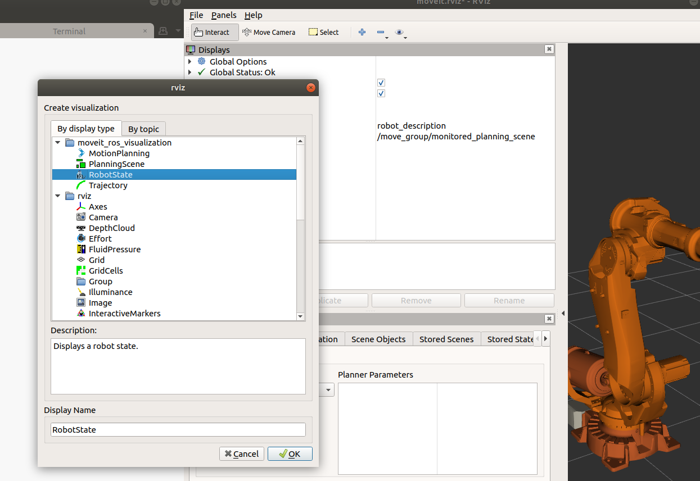
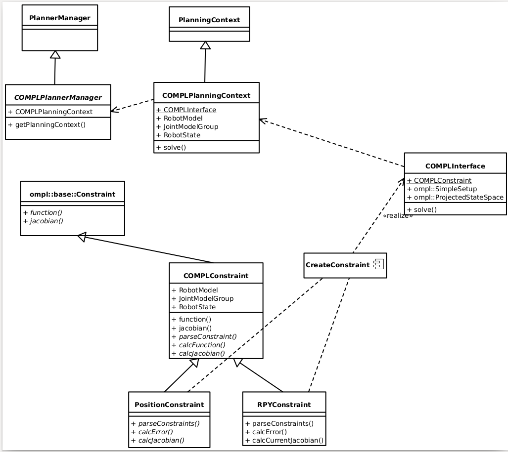

# Constrained planning plugin for MoveIt, using OMPL

This repository is supposed to become an MVP to validate that we can use the constrained planning stuff in OMPL through a simple interface.
I'm not sure if it will work.

## Setting up the workspace

The usual way of creating a new ROS workspace and cloning this repository in it should work:
```bash
mkdir -p catkin_ws/src
cd catkin_ws/src/
git clone https://github.com/JeroenDM/moveit_constrained_planning_plugin.git
rosdep install --from-paths . --ignore-src
cd ..
caktin build
```

**Note**: I think I removed all dependencies that rosdep cannot install. However I have used several unreleased dependencies in the past to to some testing. These are:
- [rviz_tools_py](https://github.com/DavidB-CMU/rviz_tools_py)
- [benchmark_planning_setups](https://github.com/JeroenDM/benchmark_planning_setups)
- [kuka_experimental](https://github.com/ros-industrial/kuka_experimental)
- [nexon](https://bitbucket.org/jeroendm/nexon/src/master/)

## Running the examples

### Panda robot
Most of the examples use the [panda_moveit_config](http://wiki.ros.org/panda_moveit_config) robot. You can find the specific settings that go with a robot at the top of a source file:
```C++
const std::string FIXED_FRAME = "panda_link0";
const std::string PLANNING_GROUP = "panda_arm";
```

Launching the MoveIt interface for the corresponding robot and running the example should work:
```bash
roslaunch panda_moveit_config demo.launch
```
and run the specific example node, for example this one to test the planning plugin:
```bash
rosrun planning_plugin_examples compl_planner_example
```
or this one to run some Jacobian calculation experiments:
```bash
rosrun planning_plugin_examples try_jacobian_projection
```

### ABB irb6640 (or other 6 dof industrial robots)

`try_jacobian_projection` should also work for other robots. However, you need to specify the planning group and fixed frame at the top of the code. For most industrial robot configurations, these names are the default:
```C++
const std::string FIXED_FRAME = "world";
const std::string PLANNING_GROUP = "manipulator";
```

With this adjusted and rebuilding the workspace, we can run the example:

```bash
 roslaunch abb_irb6640_moveit_config demo.launch
```
and in another terminal:
```bash
rosrun planning_plugin_examples try_jacobian_projection
```

To visualize the projection motion, add a RobotState display to Rviz:


**Note**: `compl_planner_example` implements a planning example that is specific to the Panda robot and therefore will not work with other robots.

## Implementation notes

I would like to separate the MoveIt and OMPL code as much as possible. So someone who understands MoveIt but not OMPL can understand the MoveIt part and visa versa.

The structure of this code is shown below. Note that the base class for constraints currently is `PositionConstraint`, the class `COMPLConstraint` does not exist yet.


## TODO

- Use `Eigen::Isometry::linear()` instead of `Eigen::Isometry3d::rotation()` whenever possible. This is more efficient (and can be used when the rotation matrix is known to be valid?).
